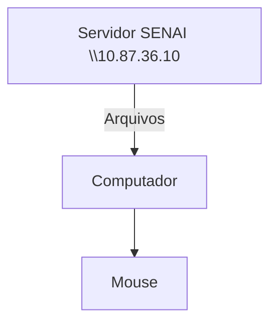
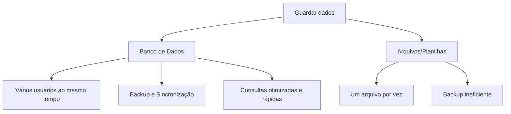

### Configuração do Servidor Educacional
O objetivo é simular um ambiente real de produção


---
## Topicos
**Objetivo**:
- Experiência real de mercado,
- Administração de rescursos,
- Experiência em servidores Linux.

## Servidor de arquivos
Servidor educacional para arquivos, assim não dependendo da rede externa.


---
## Servidor de desenvolvimento
Cada aluno recebe o seu próprio acesso. Cada máquina recebe um enedereço de IP diferente.
>192.168.10.30

|Recurso|Configuração|
|-------|------------|
|CPU|2 cores|
|RAM| 512 MB |
|DISCO| 6 GB |
|SISTEMA OPERACIONAL| Ubuntu 26.04 LTS|
|ACESSO| SSH (Secure Shell)|
-----
## Dados de acesso:
|Campo|Valor|
|-----|-----|
|IP do Container|192.168.39|
|Usuário|Root|
|Senha Inicial|aluno01|
------
## Comandos
Comando para visualizar os recursos:
```bash
htop
```
---
Comando para alteração de senha
```bash
password
```
-----
## Banco de dados
-Dados: isolados que não dizem muita . Ex: Platini, Futebol, Chuteira.

-Informação: Dados estruturados. Ex: O Platini comprou uma chuteira para jogar futebol.

-Conhecimento: O que podemos extrair destes dados. Ex: O Platini usa uma chuteira.


----

O fluxo normal de um banco de dados, está representado a baixo

>Por qual razão, as empresas não salvam os dados em arquivos comuns?


---

## SGBD
Sistema Gerenciador de Banco de Dados.
>POSTGRESQL: SGBD OpenSourse e muito completo.  

Primeiro, começamos atualizando os pacotes:
```bash
sudo apt update && upgrade
```

Para instalção do Postgresql:
```bash
sudo apt install -y postgresql
