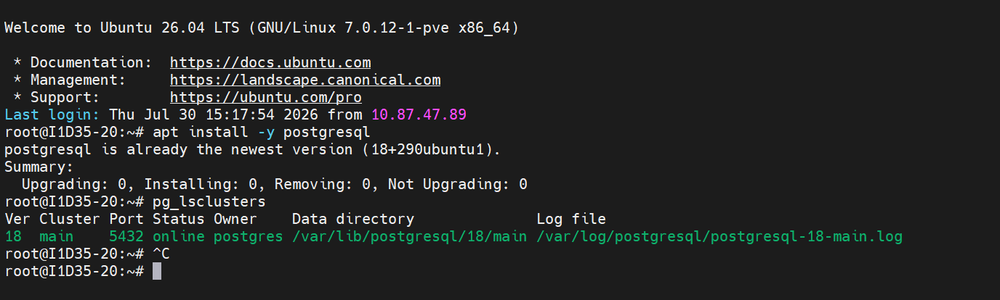
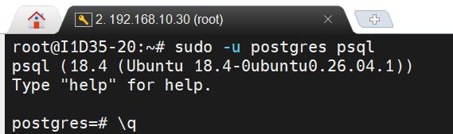
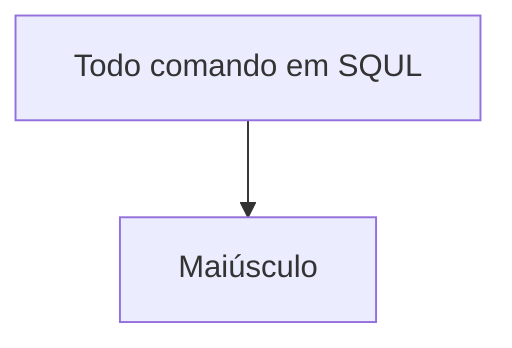
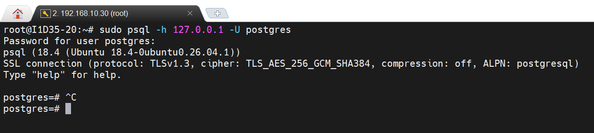
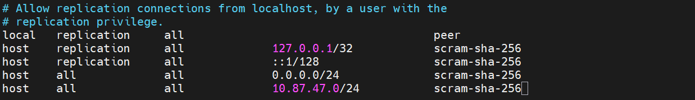
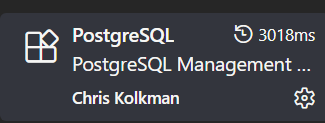
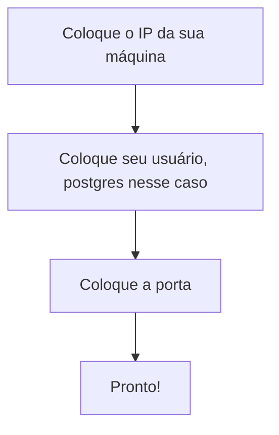

## Aula 02

**Criação e configuração do ambiente de desenvolvimento**

Para verificar o status e demais informações do banco de dados, utilizamos o comando:

```bash
pg_lsclustercs
```

----

## Passo a passo

Para acesso, via root, sem senha (SOCKET LOCAL), utilizamos o comando:

```bash
sudo -u postgres psql
```

>Com esse comando, não é necessário mostrar quem o meu usuário é, o Linux já faz a autenticação

>'\q' retorna ao usuário anterior, que seria o "quit"

---

---
Para alteração de senha do usuário Postgres, utilizamos o comando:
```sql
ALTER USER postgres PASSWORD 'senha'
```
---
Após alteração da senha, o acesso, via localhost (Socket Externo), é feito através do comando:

```bash
sudo psql -h 127.0.0.1 -U postgres
```
>Local host usado: 127.0.0.1


----

Configurações iniciais do POSTGRES:
- Para habilitar conexões externas, de outros IPs, foi necessário as seguintes etapas:

1. Navegar até a pasta do POSTGRESQL (`/etc/postgres/18/main/`).

2. Editar o arquivo `postgresql.conf` através do comando:

```bash
sudo nano postgresql.conf
```
3. Editar a linha listen_dresses = `*`

4. Editar o arquivo ph_hba.conf, usando:

```bash
sudo nano pg_hba.conf
```

>hba é o posteiro do Banco de Dados

5. Nas últimas, linhas adicionamos as seguintes configurações:

`host all all 0.0.0.0/24 scram-sha-256` <br>
`host all all 10.87.47.0/24 scram-sha-256`


---
**Criação do primeiro Banco de Dados**

```mermaid
graph TD
A[(Banco de Dados)]
````
Para criar o Banco de Dados, utilizamos o comando:

```sql
CREATE DATABASE cidades;
```

Para verificar os bancos existentes:
```sql
\l
```
----
Após a criação do Banco de Dados (`cidades`), saimos do postgres e usamos o comando:

```sql
sudo systemctl restart postgresql
```
Para resetar o sistema e salvar as alterações.
  
Para conectar ao VSC instalamos a extensão:


 
Após instalar irá aparecer este ícone:


Entre na extensão do postgres e configure ele, com os seguintes passos:


