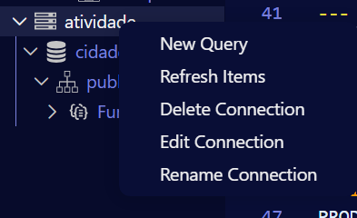
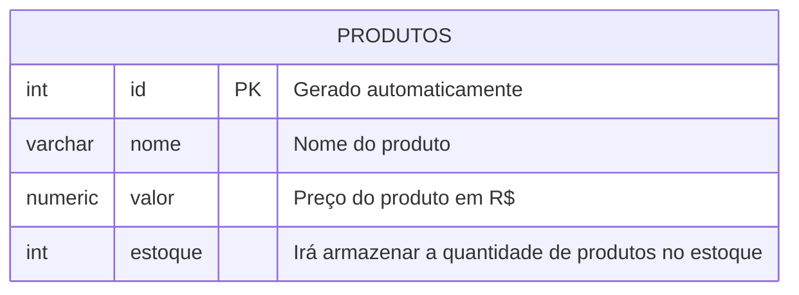

## Atividade Primeiro Banco de Dados

Primeiro criamos o Banco de Dados no Moba chamado 
>Cidades

**Estando no usuário postgres**


---

Agora aqui no VCS, para adicionar nosso Banco de Dados, fazemos o seguinte passo a passo:

>Clicamos neste icone


>Adicionamos o id


>Adicionamos o usuário


>Colocamos a senha do usuário


>Adicionamos a porta


>E entramos no Banco de Dados desejado


>Por fim irá aparecer o Banco de Dado ao lado, no meu caso renomei por "Atividades"


---
## Para Criar uma tabela usamos a opção "query", que seria como se fosse uma consulta



----

**Modelagem do Banco de Dados**

Após modelar iremos executar as etapas de criação e inserção de dados.
----
Para criar a primeira tabela usamos os comandos:
```sql
CREATE TABLE produtos(
    id INT GENERATED ALWAYS AS IDENTITY PRIMARY KEY, --Irá criar uma indentidade automaticamente para cada produto
    nome VARCHAR(100) NOT NULL,
    valor NUMERIC(10, 2) NOT NULL,
    estoque INT NOT NULL DEFAULT 0 --NOT NULL: Não nulo
    ); 

```
---
Para consultar todos os elementos da tabela, uso o comando:

```sql
SELECT * FROM produtos;
```
----
Para inserir valores, use o comando:

```sql
INSERT INTO produtos(nome, valor, estoque)
VALUES('Caneta', '1.50','100');
SELECT * FROM produtos; --Para selecionar os produtos e funcionar o código
```

---
## Tabela pronta


>Código usado no "query"

 


