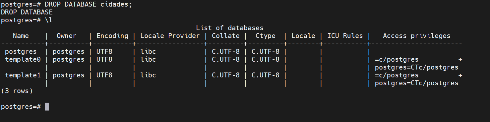
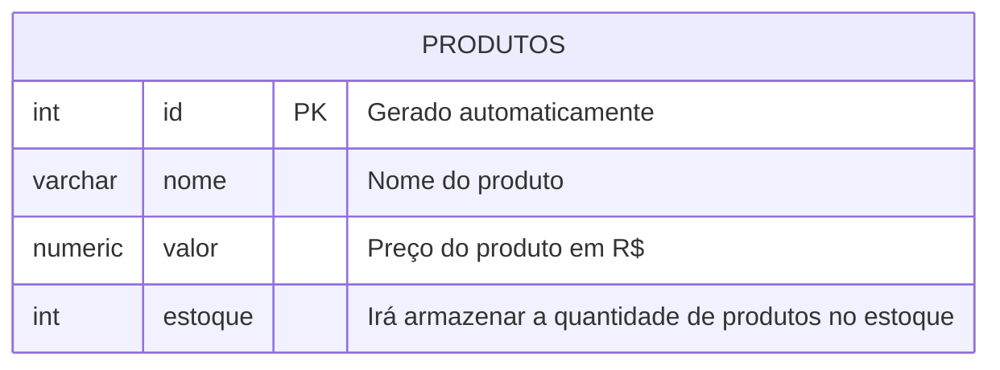
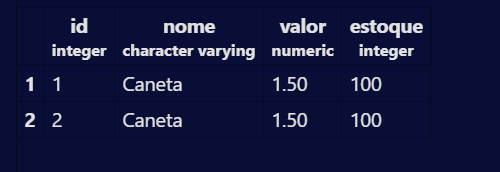

## Aula 03

Para apagar um Banco de Dados, utilizamos o comando:

```sql
DROP DATABASE cidades;
```

>Não esquecer do ";"


---

**Modelagem do Banco de Dados**


Após modelar iremos executar as etapas de criação e inserção de dados.
----
Para criar a primeira tabela usamos os comandos:
```sql
CREATE TABLE produtos(
    id INT GENERATED ALWAYS AS IDENTITY PRIMARY KEY, --Irá criar uma indentidade automaticamente para cada produto
    nome VARCHAR(100) NOT NULL,
    valor NUMERIC(10, 2) NOT NULL,
    estoque INT NOT NULL DEFAULT 0 --NOT NULL: Não nulo
    ); 

```
---
Para consultar todos os elementos da tabela, uso o comando:

```sql
SELECT * FROM produtos;
```
----
Para inserir valores, use o comando:

```sql
INSERT INTO produtos(nome, valor, estoque)
VALUES('Caneta', '1.50','100');
SELECT * FROM produtos; --Para selecionar os produtos e funcionar o código
```
Como fica a tabela depois de pronta:

