# ATIVIDADE - AULA 05
 
 **Vamos criar uma tabela sobre livro?**

Primeiro criamos um Banco de Dados pelo Moba, com o nome desejado:


Usamos os comandos:

```slq
CREATE DATABASE livros;
```

*Para criar o Banco de Dados*

```sql
\l
```

*Para verificar se o Banco de Dados foi criado*

---

## No VSC

Clicamos neste símbolo, que seria a extensão do Postgres:


Criamos uma nova conexão com o Banco de Dados:


**Após as configurações necessárias** -> Não esqueça de selecionar o Banco de Dados desejado, caso tenha mais de um:

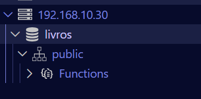

Para começar a editar a tabela clique em "NEW QUERY":

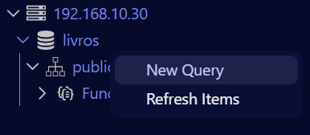

----

## Agora sim podemos ir para os códigos 

Primeiro vamos criar a tabela aqui, usando o comando:

```sql
CREATE TABLE
```


Após criar a tabela e as colunas desejadas, com suas devidas variáveis, vamos inserir os valores, ou seja, o que vai aparecer em cada coluna da tabela:

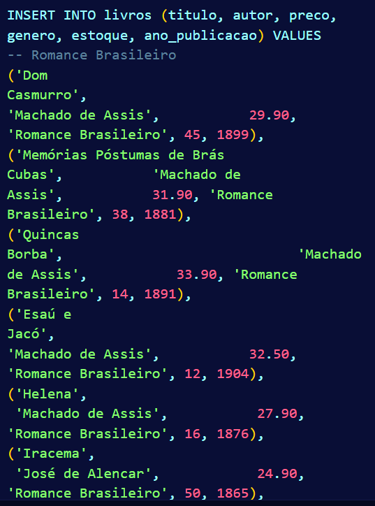

Código para inserir valores:

```sql
INSERT INTO
```

*Podemos perceber que os valores são inseridos em ordem que foi atribúido*

Caso queira ver como a tabela está use o comando:

```sql
SELECT * FROM 
```
*Irá aparecer a tabela inteira*

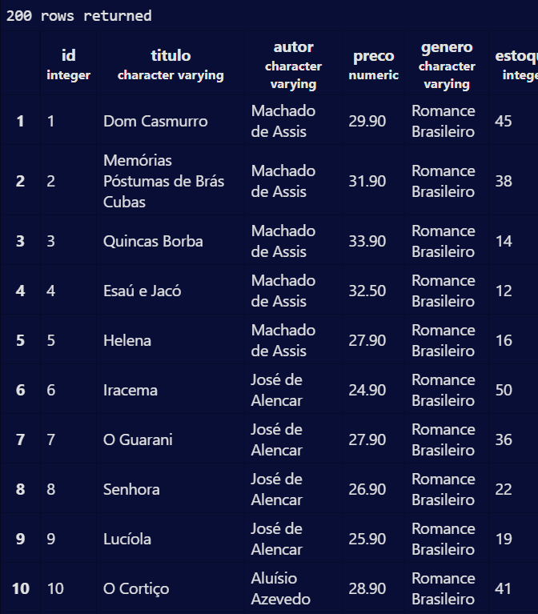

Caso queira exibir apenas os 10 primeiros registros, use o comando:

```sql
SELECT * FROM livros LIMIT 10; 
```
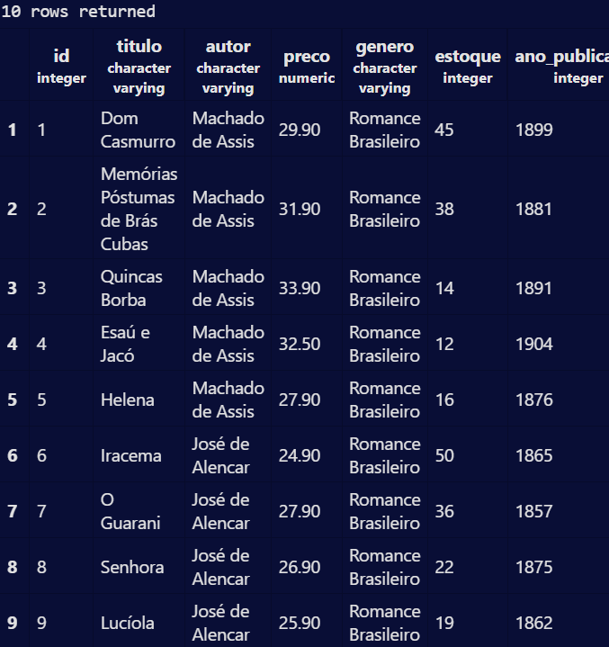

Agora caso você queira exibir apenas as colunas titulo, autor e preco de todos os livros, use o comando:

```sql
SELECT titulo, autor, preco FROM livros;
```
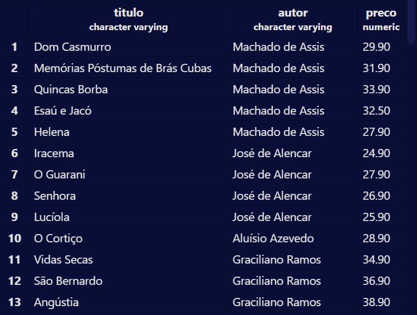

Para listar os gêneros distintos existentes na base, em ordem alfabética:

```sql
SELECT DISTINCT genero FROM livros ORDER BY genero;
```
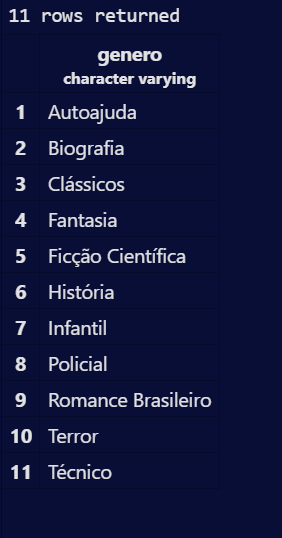

Para descubrir quantos autores diferentes existem:

```sql
SELECT DISTINCT autor FROM livros ORDER BY autor;
```
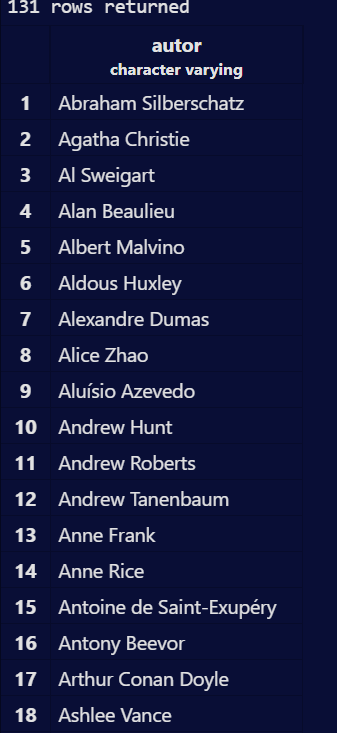

Para listar os 5 livros mais caros da base (título e preço):

```sql
SELECT titulo,preco FROM livros WHERE preco > 280;
```
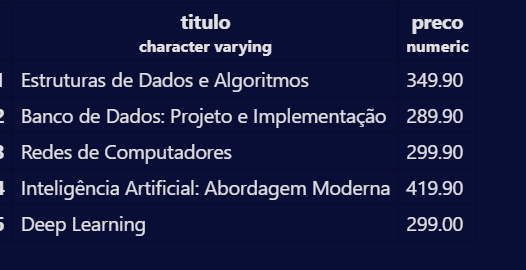

Para listar os 5 livros com menor estoque (título e estoque):

```sql
SELECT titulo,estoque FROM livros WHERE estoque < 4;
```
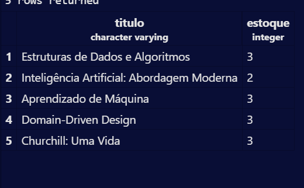

----

# Filtros numéricos

Mostrar titulo e estoque de todos os livros do gênero Técnico:

```sql
SELECT titulo, estoque FROM livros
WHERE genero = 'Técnico'
```
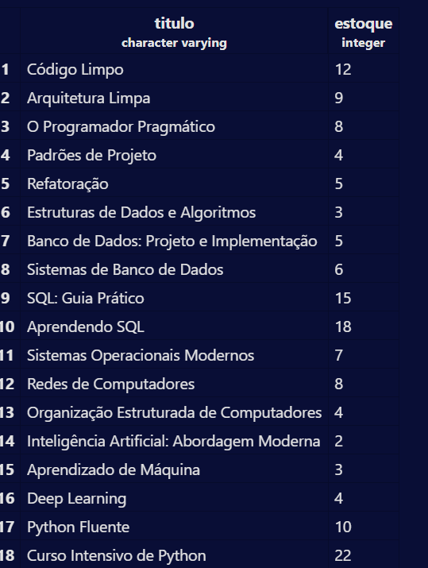

Mostrar titulo e preco dos livros que custam mais de R$ 200,00:

```sql
SELECT titulo,preco FROM livros WHERE preco > 200;
```
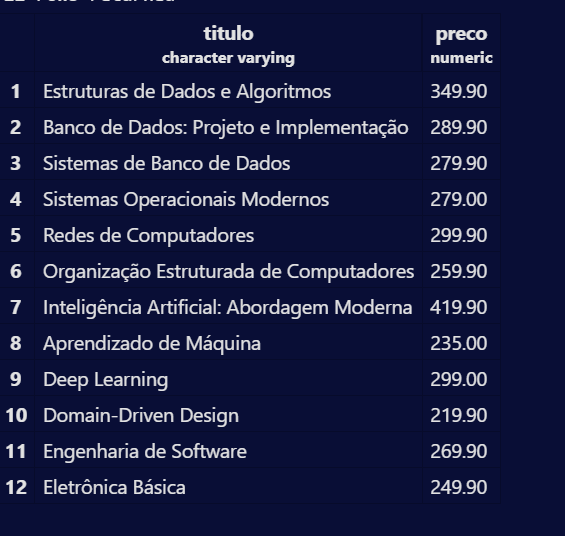

Mostrar titulo e preco dos livros com preço entre R$ 40,00 e R$ 70,00:

```sql

SELECT titulo,preco
FROM livros 
WHERE preco BETWEEN 40
AND 70;
```
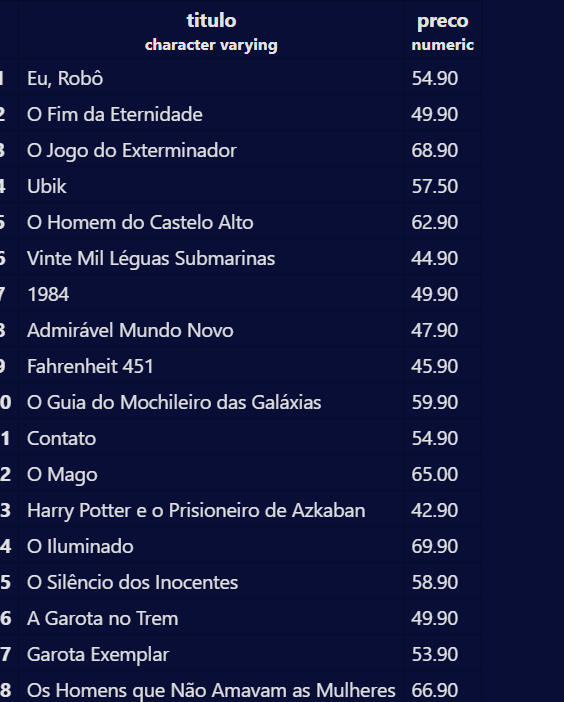

Mostrar os livros com estoque abaixo de 5 unidades (situação de reposição urgente):

```sql
SELECT titulo,estoque FROM livros WHERE estoque < 5;
```
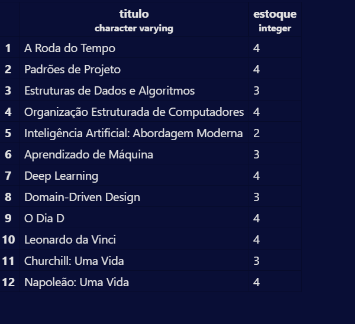

Listar os livros publicados antes de 1900, ordenados do mais antigo para o mais recente:

```sql
SELECT titulo, ano_publicacao
FROM livros
WHERE ano_publicacao < 1900
ORDER BY ano_publicacao DESC
```
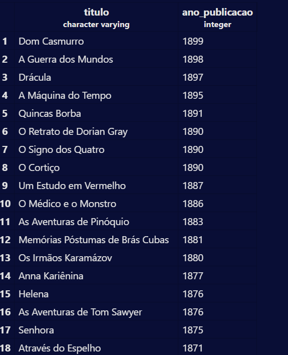

Listar os livros publicados entre 2010 e 2020, mostrando título, ano e gênero:

```sql
SELECT titulo, ano_publicacao, genero 
FROM livros
WHERE ano_publicacao BETWEEN 2010 AND 2020;
```
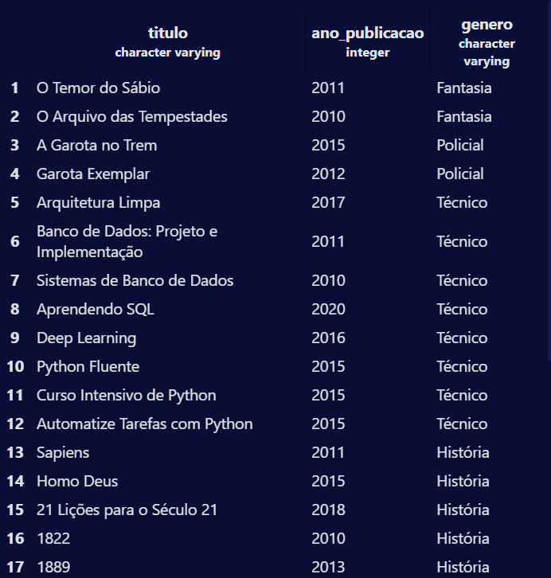