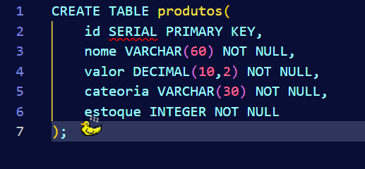
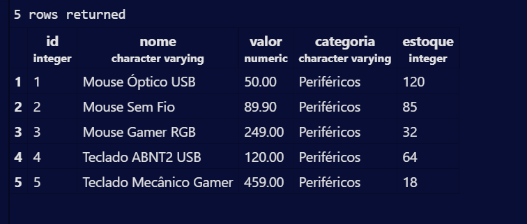
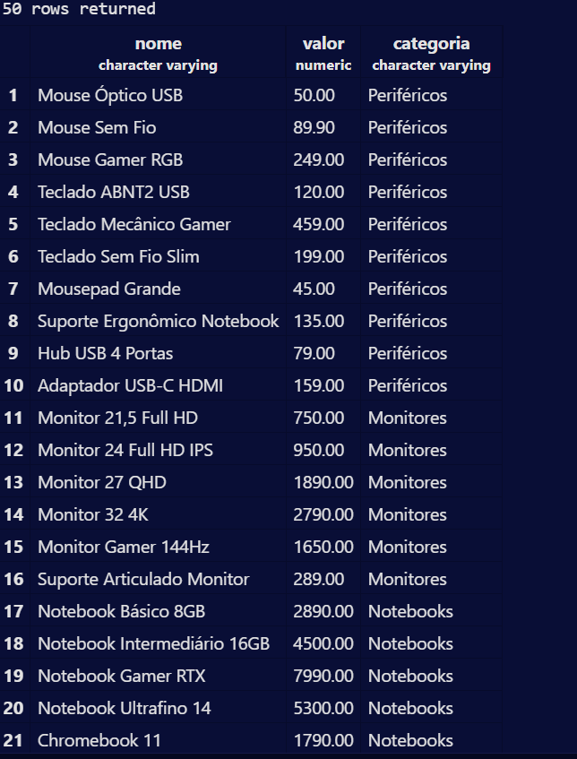
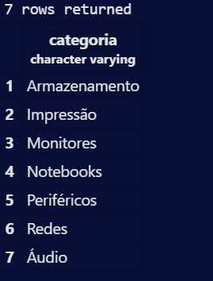

# Aula 05 - PARTE 01
**Criação e inserção de dados, realizando algumas consultas avançadas.**

Para criar tabela

```sql 
CRETE TABLE 
```



----

Em uma base de dados muito grande é interessante filtras registro, ou seja, limitar até qual numero quero ver:

```sql
SELECT * FROM produtos LIMIT 5; 
```

---

Para filtrar colunas:

```sql
SELECT nome, valor, categoria FROM produtos;
```



----

Para filtrar categorias distintas:

```sql
SELECT DISTINCT categoria FROM produtos ORDER BY categoria;
```



## PARTE 02
**Filtro de dados**

```sql
Vetor
```
É um segmento de reta que possui direção e sentido.

Para filtrar produtos por categoria:

```slq
SELECT nome, estoque FROM produtos
WHERE categoria = 'redes'
```
Filtro de valores mais caros:

```sql
SELECT nome,estoque FROM produtos WHERE valor > 1000;
```

Aritmeticos:
```sql
<> =
```

Condicionais:
```slq
IF, ELSE
```

Logicos:
```sql
AND
```

Filtro entre faixa de valores:

```sql
SELECT nome,estoque 
FROM produtos 
WHERE valor BETWEEN 100
AND 500;
```
**OU**

```slq
SELECT nome,estoque 
FROM produtos 
WHERE valor >= 100 AND 
valor <= 500;
```

Operador coringa, completa depois do que foi escrito:

```sql
%
```
Desconsidera letras maiúsculas/ Busca por trecho de texto:

```slq
LIKE
```
Entre isso e isso:

```sql
BETWEEN
```